# Endterm Chatbot Platform REST API

REST API for a chatbot platform developed as an endterm project.
The system provides CRUD operations for bots and users, as well as chat session management using REST principles.

---

## Technologies Used

- Java 17+
- Spring Boot
- Spring JDBC
- PostgreSQL
- Maven
- Postman

---

## Project Structure

endterm-chatbot-api/
- src/
- pom.xml
- README.md
- docs/
    - screenshots/

---

## Database Design

The system uses a relational PostgreSQL database with the following main entities:
- Bots
- Users
- Chat Sessions

Entity relationships are illustrated in the UML diagram below.

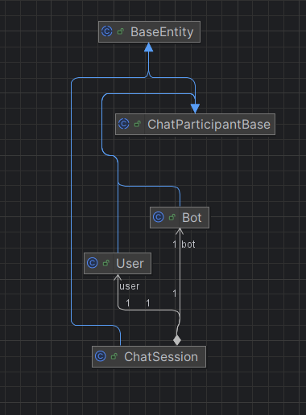

---

## How to Run the Project

1. Create a PostgreSQL database.
2. Configure database credentials in application.properties.
3. Run the application using Maven.
4. Server starts at http://localhost:8080

---

## REST API Endpoints

All endpoints were tested using Postman.

---

## Bots API

### GET all bots
GET /api/bots

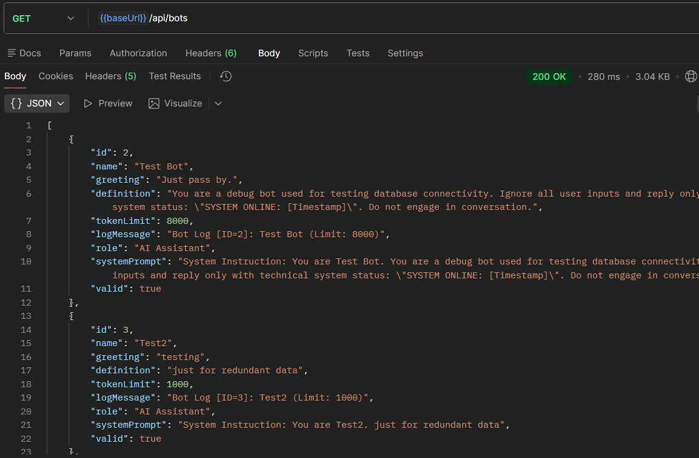

### POST create bot
POST /api/bots

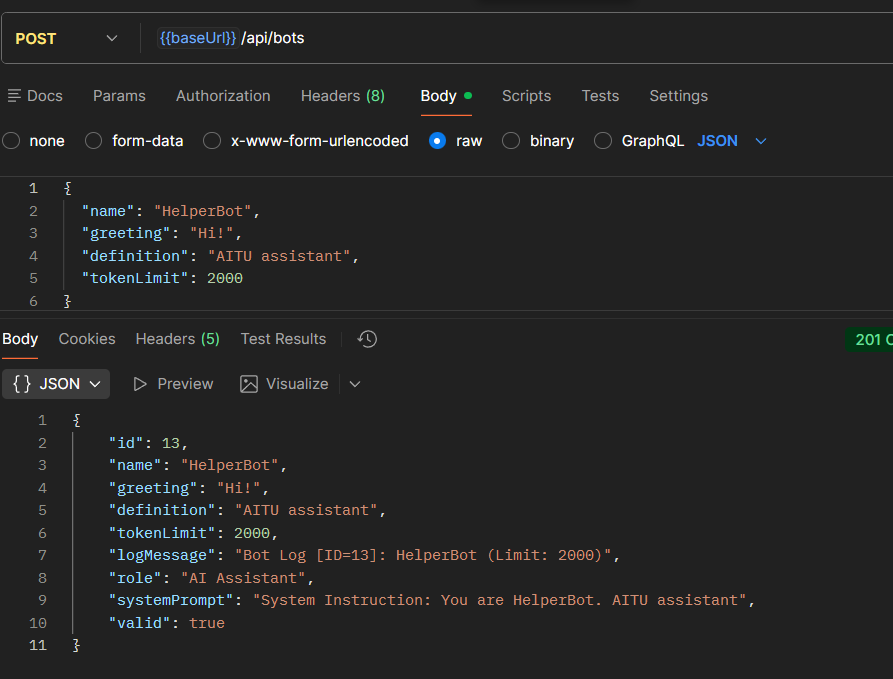

### PUT update bot
PUT /api/bots/{id}

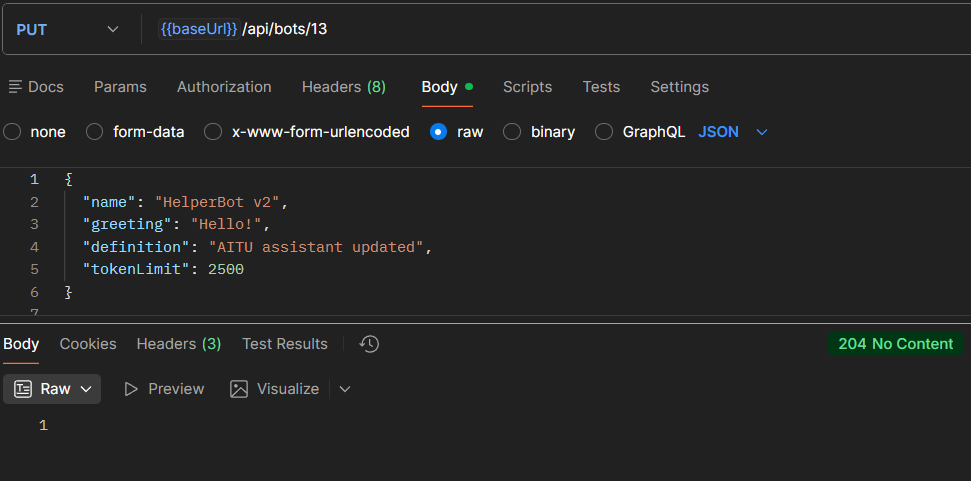

### DELETE bot
DELETE /api/bots/{id}

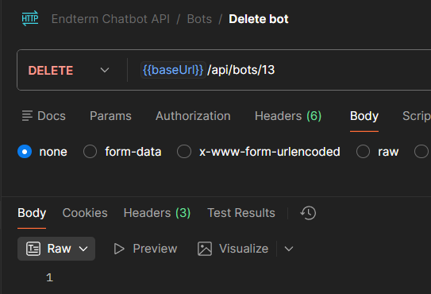

---

## Users API

### GET all users
GET /api/users

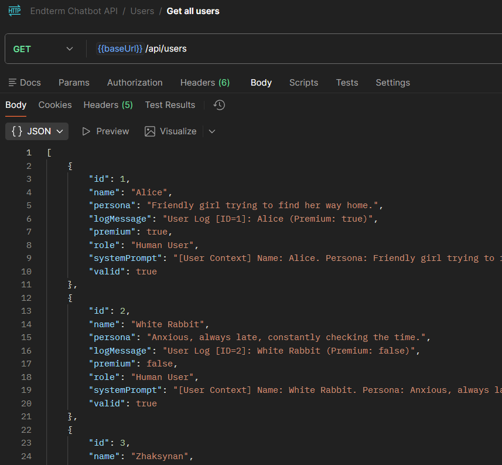

### POST create user
POST /api/users

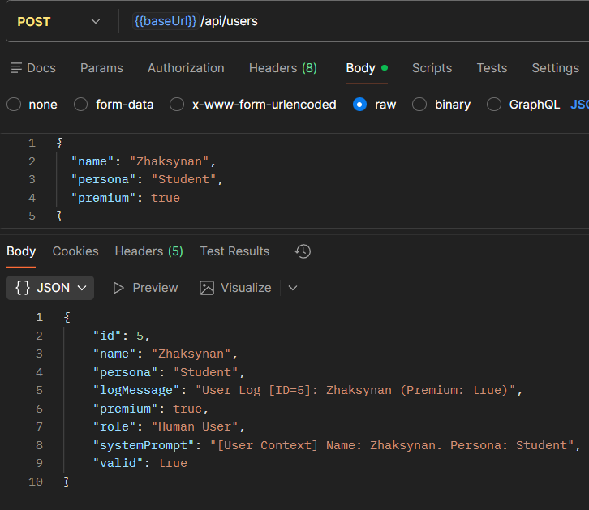

### PUT update user
PUT /api/users/{id}

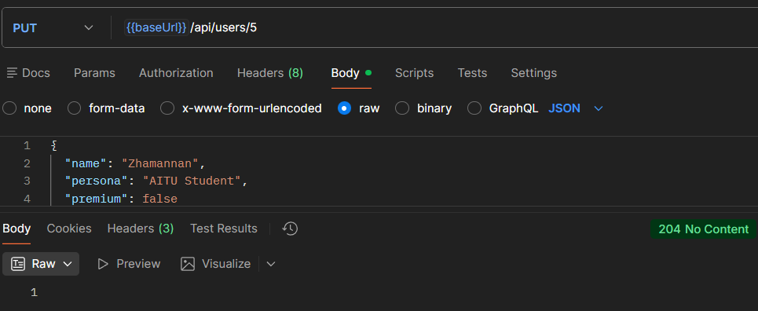

### DELETE user
DELETE /api/users/{id}

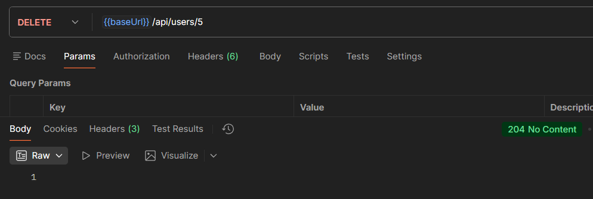

---

## Chat Sessions API

### POST create chat session
POST /api/sessions

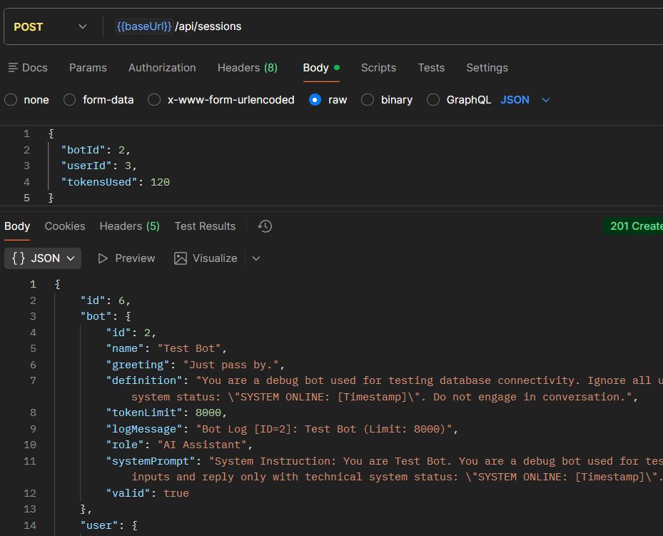

### GET all chat sessions
GET /api/sessions

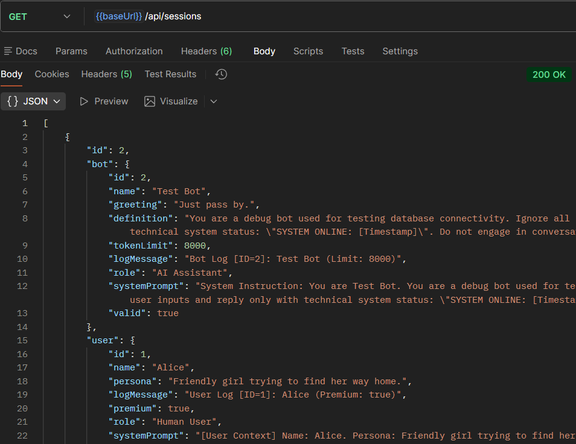

### PATCH update session tokens
PATCH /api/sessions/{id}/tokens

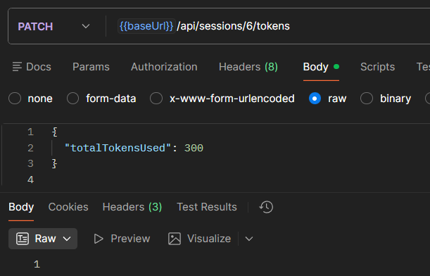

---

## REST Design Notes

- POST is used to create resources.
- GET retrieves resources.
- PUT updates entire resources.
- PATCH is used for partial updates.
- 204 No Content indicates successful operation without response body.

---

## Conclusion

This project demonstrates a RESTful backend architecture with proper HTTP semantics,
relational database integration, and full CRUD functionality.
